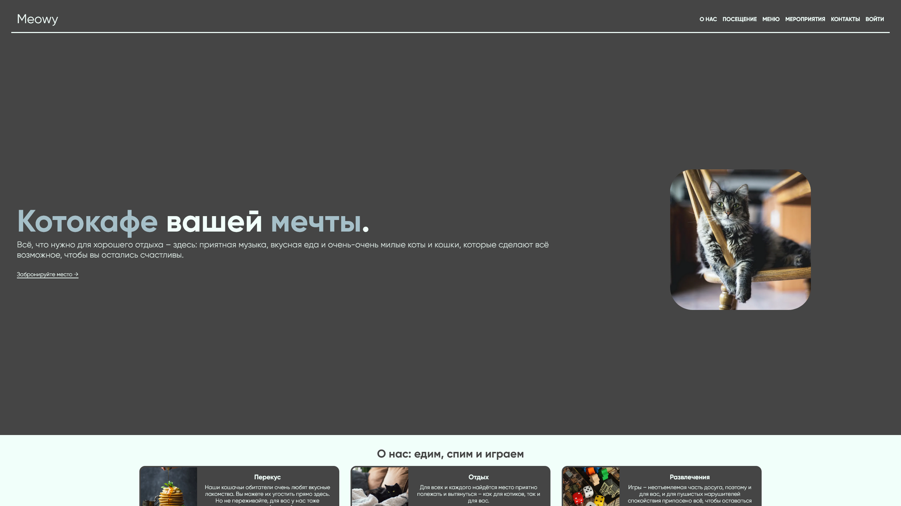

# Meowy (Uni.Sem2.Web)

**Meowy** is a website for the fictional cat café Meowy. It is also coursework for two university courses ("Web programming" and "Databases").

Website is available on <https://meowy.arasfon.ru>

## Project overview

- 15 different pages utilizing layout system
- Responsive design
- Animations for mobile menu
- Special page for unexpected error handling
- Booking form with client-side and server-side validation and user linking
- Authentication and authorization
- News display/edit/creation using WYSIWYG Markdown editor
- Editable user profiles
- OpenGraph
- HTTP/3
- Cloudflare proxy
- Source maps for development, CSS/JS/HTML minification in production

## Used technologies

- Git
- Azure Pipelines
- Docker

- ASP.NET Core 8
- PostgreSQL 16
- EntityFramework Core 8

- Node.js
- TypeScript
- Rollup
- Less
- Terser
- clean-css
- Gulp

Libraries:

- [FluentValidation](https://github.com/FluentValidation/FluentValidation)
- [WebMarkupMin](https://github.com/Taritsyn/WebMarkupMin)

- [tui.editor](https://github.com/nhn/tui.editor)
- [flatpickr](https://github.com/flatpickr/flatpickr)
- [Glide.js](https://github.com/glidejs/glide)
- [Anime.js](https://github.com/juliangarnier/anime)
